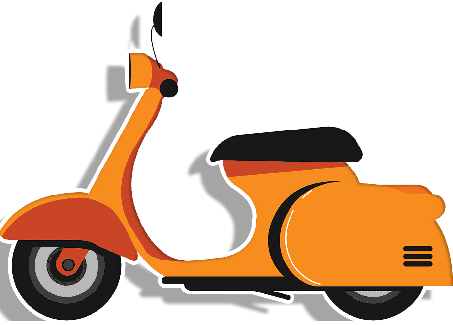

<div align="center">
  <!-- You are encouraged to replace this logo with your own! Otherwise you can also remove it. -->
 
  <br/>
  <h2><b> MOTORCYCLE RENTAL STORE</b></h2>
</div>

# 📗 Table of Contents

- [📗 Table of Contents](#-table-of-contents)
- [🛵\[Booking Vespa API\] ](#about-project)
- [🛠 Built With ](#-built-with-)
  - [Tech Stack ](#tech-stack-)
  - [Key Features ](#key-features-)
- [🚀 Live Demo](#Live-Demo)
- [🧾 Database Structure](#erd)
- [📄\[Project Documentation\] ](#project-documentation)
- [✒ Kanban Board](#kanban-board)
- [🛠 Built With ](#built-with)
- [💻 Getting Started](#getting-started)
  - [Prerequisites](#prerequisites)
  - [Front end](#front-end)
    - [Setup](#setup)
    - [Install](#install)
    - [Usage](#usage)
    - [Run tests](#run-tests)
    - [Deployment](#deployment)
  - [Back end](#back-end)
    - [Setup](#setup)
    - [Install](#install)
    - [Usage](#usage)
    - [Run tests](#run-tests)
    - [Deployment](#deployment)
- [👥 Authors / Team members ](#authors)
- [🔭 Future Features ](#future-features)
- [🤝 Contributing ](#contributing)
- [⭐️ Show your support ](#️support)
- [🙏 Acknowledgments ](#acknowledgements)
- [📝 License ](#license)

<!-- PROJECT DESCRIPTION -->

# Booking Motorcycle 🛵 <a name="about-project"></a>

_This project is for reserving motorcycles._
_Whether you're gearing up for a special occasion or event and need a trendy scooter, or if you own a luxurious Vespa and want to earn extra income by renting it out, our website is your ideal destination._

_Here are some key advantages of using our platform:_

_Extensive variety of vehicles available for your selection_
_The primary functionalities of this website include:_

_- Providing users with comprehensive information about all available vi._
_- Enabling users to make reservations for a Vespa for their special occasions._
_- Allowing users to list their own Vespas for rent and manage their listings as needed._

## 🛠 Built With <a name="built-with"></a>

### Tech Stack <a name="tech-stack"></a>

<details>
  <summary>Client</summary>
  <br>
  <ul>
    <a href="https://github.com/microverseinc/linters-config/tree/master/ror">
      
    </a>
    <br>
    <a href="https://github.com/microverseinc/linters-config/tree/master/ror">
      
    </a>
  </ul>
</details>
<details>
<summary>Server</summary>
  <br>
  <ul>
    <a href="https://www.ruby-lang.org/en/">
      
    </a>
    <br>
    <a href="https://rubyonrails.org/">
      
    </a>
    <br>
    <a href="https://github.com/jwt/ruby-jwt">
      
    </a>
    <br>
    <a href="https://render.com/">
      
    </a>
    <br>
    </ul>
</details>

<details>
<summary>Database</summary>
  <br>
  <ul>
    <a href="https://www.postgresql.org/">
      
    </a>
  </ul>
</details>

<!-- Features -->

### Key Features <a name="key-features"></a>

_**Login or register user:**_

- _Create an account by providing a valid username and password._
- _Once your account is created, you'll be automatically logged in and can access all of the app's features._

_**Trips**:_

- _Once you're logged in, you can browse through a list of all available motorcycles._
- _Get the details of a specific vespa/morotcycle by clicking on it. You can also reserve/book the selected vehicle from the details page._
- _On the reserve page, fill out the information and reserve the best scooter in town! That's it. Congratulations!_

_**Add/Delete:**_

- _If you want to add a new vehicle, just click on the **Add** link in the navigation panel, and you'll be directed to a page where you can fill out a form to add a new vehicle._
- _If you want to delete a vehicle, click on the **Delete** link in the navigation panel. You will be redirected to a page where you can see a list of all available vehicles from where you can delete some of them._

_**Reservations:**_

- _To see all your reservations in one place, head to the My Reservations page. Here, you can see a list of all your reservations and get a glimpse of the details._

<p align="right">(<a href="#readme-top">back to top</a>)</p>

## 🚀 Live Demo

To see this project's live demo, please click [here - comming soon]().

## 🧾 Database Structure: <a name="erd"></a>

#### Motorcycle Rentals Front End

> _Our frontend code is built using React and Redux and is hosted on a separate repository. The frontend handles the user interface and integrates with our backend API to retrieve and display data. Click the link below to get front end code_

[](https://github.com/TamaraDimov/vespa-rentals-frontend)

#### Motorcycle Rentals Back End

> _Our backend code is built using Ruby and Postgres database and is hosted on a separate repository from the frontend.Below you can find the link of the repository and you can see our database structure_

[](https://github.com/TamaraDimov/vespa-rentals-backend)


## 📄 Project Documentation <a name="project-documentation"></a>

_Here you can find a detailed documentation for the API used in the project, including endpoints, request/response formats, and authentication methods. Developers can use this documentation to integrate our service into their applications and build custom integrations._

- Front-end GitHub repository [link](https://github.com/TamaraDimov/vespa-rentals-frontend)👈
- Back-end API [link](https://github.com/TamaraDimov/vespa-rentals-backend) 👈
- API Documentation [link](https://github.com/TamaraDimov/vespa-rentals-backend) 👈

## ✒ Kanban Board <a name="kanban-board"></a>

_We used a Kanban board to track the progress of tasks and issues. The board is designed to help visualize the status of work items, identify bottlenecks, and ensure that work is flowing smoothly._

### Kanban Board [link](https://github.com/users/TamaraDimov/projects/4/views/1?layout=board)

  <details>
    <summary>Initial State</summary>


  </details>Final State;</summary>

  <details>
    


  </details>
</details>
<p align="right">(<a href="#readme-top">back to top</a>)</p>

## 💻 Getting Started <a name="getting-started"></a>

_To get a local copy up and running follow these simple steps._

### Prerequisites

_In order to run this project you need:_

- Mac or PC
- Install node.js
- Use npm as package manager.
- Understanding of React and Redux

## Front end

### Setup

- _Clone this repository to your desired folder: https://github.com/TamaraDimov/vespa-rentals-frontend.git_

```sh
 git clone
```

- _Navigate into the cloned folder_

```sh
 cd vespa-rentals-frontend

```

### Install

Install thr project dependencies with:

```
  npm install
```

### Usage <a name="usage"></a>

To run the project, execute the following command:

```
  npm start or npm s
```

### Run tests

To run the tests, run the following command:

```
  npm test
```

### Deployment

You can deploy this project using:

```
   npm run build
```

## Back end

### Setup

- _Clone this repository to your desired folder: https://github.com/TamaraDimov/vespa-rentals-backend.git_

```sh
 git clone
```

- _Navigate into the cloned folder_

```sh
 cd vespa-rentals-backend

```

### Install

Install thr project dependencies with:

```
  bundle install
  rails db:create
  rails db:migrate
```

### Usage<a name="usage"></a>

To run the project, execute the following command:

```
  rails server or rails s
```

### Run tests

To run the tests, run the following command:

```
  rspec ./spec/models
  rspec ./spec/controllers
```

### Deployment

You can deploy this project using:

```
  ./bin/dev
```

<p align="right">(<a href="#readme-top">back to top</a>)</p>

## 👥 Authors / Team members <a name="author"></a>

👤 **Tamara Dimov**

- GitHub: [@TamaraDimov](https://github.com/TamaraDimov)
- LinkedIn: [Tamara Dimov](https://www.linkedin.com/in/tamara-dimov-b85139a2/)

👤 **Kifle Haile**

- GitHub: [Kifle Haile](https://github.com/kifle23)
- Twitter: [Kifle Haile](https://twitter.com/KifleHaile12)
- LinkedIn: [Kifle Haile](https://www.linkedin.com/in/kifle-haile)

👤 **Daniel Safari**

- GitHub: [Daniel Safari](https://github.com/danielsafari143)
- Twitter: [Daniel Safari](https://twitter.com/DanielSafari143)
- LinkedIn: [Daniel Safari](https://www.linkedin.com/in/safari-daniel-a01744251/)

👤 **Besufekad Alemu**

- GitHub: [Besufekad Alemu](https://github.com/besufekad-haz)
- LinkedIn: [Besufekad Alemu](https://www.linkedin.com/in/besura/)

<p align="right">(<a href="#readme-top">back to top</a>)</p>

## 🚀 Future Features <a name="future-features"></a>

- _Integrate a rating feature to allow users give ratings to booked Vespas._

<p align="right">(<a href="#readme-top">back to top</a>)</p>

## 🤝 Contributing <a name="contributing"></a>

_Contributions, issues, and feature requests are welcome!_

_Feel free to check the [issues page](https://github.com/TamaraDimov/vespa-rentals-backend/issues)._

<p align="right">(<a href="#readme-top">back to top</a>)</p>

## Show your support <a name="️support"></a>

_If you like this project, please give it a ⭐️ !_

## Acknowledgments

- [Microverse](https://www.microverse.org/)

## 📝 License <a name="license"></a>

_This project is [MIT](./LICENSE) licensed._

<p align="right">(<a href="#readme-top">back to top</a>)</p>
